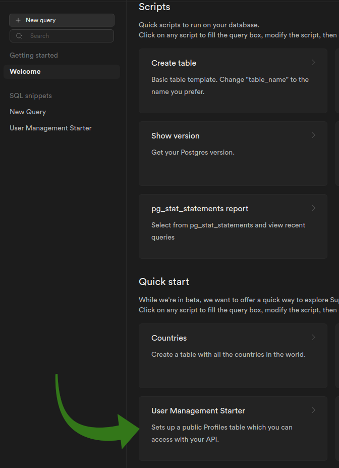

# BOBLE

Online Free Web Chat. Live at [chat.marioph.com](https://www.chat.marioph.com/)

If you want to start your first conversation and have no other users to chat with, follow my [invite code.](https://chat.marioph.com/invite/0f06b352-ad38-4101-8f35-c6926985e7ab)

📸 **[Screenshots](https://github.com/marioperezhurtado/Boble/tree/main/doc/screenshots)**

#### Key features:

- **Private chats** 👥
- **Groups** with unlimited participants 📢
- Share text messages, images, GIFs, and audio recordings in **real-time** 📡
- All your data is stored in the **cloud** and **protected** through your account 🔒
- **Create** and **delete** chats and messages, and **manage** your groups ✏️
- Access from **all your devices**, since you only need a browser 💫
- Only requires a verified email address, no phone number, payment or other personal information 😇
- **Translated** into different languages (_currently English, Spanish and French_) 🌎

This project was made to **learn** about some tools.

This is **not** a professional or for-profit project.

If you want to make a similar project with some of this tools, this could be a **reference example** (_that's why I share it_), but don't expect everything to be as correct as it could be.

If you have any suggestions or encounter any problems, feel free to **report** them.

<p>
  
  
  
  
</p>

## Table of contents

- [Tech Stack](#-tech-stack)
- [Tools / Dependencies](#-tools--dependencies)
- [External API's](#-external-apis)
- [Installation](#-installation)
- [Supabase Setup](#-supabase-setup)
- [Environment Variables](#-environment-variables)
- [Run locally](#-run-locally)
- [Test application](#-test-application)
- [Build for production](#%EF%B8%8F-build-for-production)

## 🧑‍💻 Tech Stack

**[React](https://es.reactjs.org/)** - JavaScript library for building user interfaces

**[Typescript](https://www.typescriptlang.org/)** - Strongly typed JavaScript

**[TailwindCSS](https://tailwindcss.com/)** - Utility-first CSS framework

**[Supabase](https://supabase.com/)** - Open source backend as a service

## 🔧 Tools / Dependencies

**Bundler:** [Vite](https://vitejs.dev/)

**Routing:** [Wouter](https://github.com/molefrog/wouter)

**Server state management:** [TanStack Query](https://tanstack.com/query/v4/)

**Testing:** [Vitest](https://vitest.dev/)

**Linting:** [ESLint](https://eslint.org/)

**Integration with Supabase:** [Supabase-js](https://github.com/supabase/supabase-js)

**Translation:** [React-i18next](https://react.i18next.com/)

**QR Code:** [React-qr-code](https://www.npmjs.com/package/react-qr-code)

**Resize Observer:** [Use-resize-observer](https://github.com/ZeeCoder/use-resize-observer)

## 📡 External API's

**GIF Integration:** [GIPHY](https://developers.giphy.com/)

## 🚀 Installation

```bash
git clone https://github.com/marioperezhurtado/Boble.git
cd Boble
npm install
```

## ⚡ Supabase Setup

https://supabase.com/docs

You can find the SQL queries and policies of this project [here](./doc/Boble.sql), or you might create your own.

Resulting database schema: (Generated w/ [supabase-schema](https://github.com/zernonia/supabase-schema) )


- Create an account on Supabase.

- Create a new project in the Supabase dashboard.

- Get the URL and the anon key of your project, and set them in your [.env file](#-environment-variables)

  https://app.supabase.com/project/^your-proyect^/settings/api

- Run "User Management Starter" SQL query.



- Enable and configure authentication providers (google, github).

  https://app.supabase.com/project/^your-proyect^/auth/providers

- Create tables and setup its RLS (Row Level Security) policies.

  https://app.supabase.com/project/^your-proyect^/auth/policies

- Enable realtime updates.

- Enable storage, create buckets and setup its policies.

  https://app.supabase.com/project/^your-proyect^/storage/buckets

## 💬 Environment Variables

To run this project, you will need to add the following environment variables to your .env file

`VITE_APP_URL='https://your-url.com'`

`VITE_APP_GIPHY_API_KEY='your-giphy-api-key'`

`VITE_APP_SUPABASE_URL='your-supabase-url'`

`VITE_APP_SUPABASE_ANON_KEY='your-anon-key'`

Supabase env variables can be found at https://app.supabase.com/project/^your-proyect^/settings/api

## 💻 Run locally

```bash
  npm run dev
```

## 🔬 Test application

```bash
  npm run test
```
